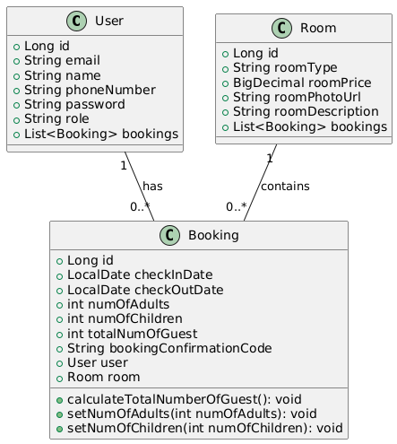

# 🏨 AtlasStay — Full-Stack Hotel Booking Platform

AtlasStay is a **full-stack hotel booking platform** developed to simulate a real-world accommodation reservation system.

The application combines a **React frontend**, **Vite development environment**, **Tailwind CSS styling**, and a **Java Spring Boot backend** connected to a **MySQL database**.

The project demonstrates end-to-end development: from building a responsive user interface and consuming REST APIs to implementing business logic, authentication, persistence, validation, and relational data modeling.

---

## ✨ Application Overview

AtlasStay provides an end-to-end accommodation booking experience.

### 👤 For Customers

Users can:

* Browse available rooms
* Explore room information and pricing
* View accommodation details
* Select rooms according to their requirements
* Create and manage reservations
* Access their booking information
* Manage their account

### 🏨 For the Platform

The backend manages:

* Users and authentication
* JWT authentication
* OAuth2 with Google
* Hotels and rooms
* Room availability
* Reservations
* Confirmation by email
* Business rules
* Data validation
* Relationships between entities
* Persistent storage

---

# 🎨 Frontend

The AtlasStay frontend was built with **React**, **Vite**, and **Tailwind CSS**.

The goal was not simply to create static pages, but to build an interactive client application that communicates with the backend through REST APIs.

### Frontend Stack

| Technology                  | Purpose                                            |
| --------------------------- | -------------------------------------------------- |
| **React**                   | Component-based UI development                     |
| **Vite**                    | Fast development server and frontend build tooling |
| **Tailwind CSS**            | Responsive styling and UI design                   |
| **JavaScript / TypeScript** | Application logic                                  |
| **REST API integration**    | Communication with the Spring Boot backend         |

### Frontend Responsibilities

The React application handles the customer-facing experience, including:

* Navigation between application pages
* Hotel and room presentation
* Booking interfaces
* User authentication flows
* Forms and user input
* API requests
* Displaying backend data
* Booking-related interactions
* Responsive layouts
* Reusable UI components

### ⚡ React + Vite

Using Vite provides a fast development workflow with rapid feedback during frontend development.

React is used to structure the application into reusable components rather than building the interface as a collection of independent static pages.

This makes the frontend easier to maintain and extend as new functionality is introduced.

### 🎨 Tailwind CSS

Tailwind CSS is used to build the application's visual interface through utility-based styling.

It allows the application to maintain consistent:

* Spacing
* Typography
* Layouts
* Buttons
* Forms
* Cards
* Responsive behavior
* Visual hierarchy

The frontend was designed with responsiveness in mind so that the booking experience can adapt to different screen sizes.

---

# 🔄 Frontend ↔ Backend Integration

One of the main engineering aspects of AtlasStay is the integration between the React client and Spring Boot backend.

```text
┌─────────────────────────────┐
│        React Frontend       │
│                             │
│  Components                 │
│  Pages                      │
│  Forms                      │
│  UIs                        │
│  User Interface             │
└──────────────┬──────────────┘
               │
               │ HTTP / REST API
               ▼
┌─────────────────────────────┐
│       Spring Boot API       │
│                             │
│ Controllers                 │
│ Services                    │
│ Business Logic              │
│ Validation                  │
│ Authentication              │
└──────────────┬──────────────┘
               │
               │ JPA / Hibernate
               ▼
┌─────────────────────────────┐
│         PostgreSQL          │
│                             │
│ Users                       │
│ Hotels                      │
│ Rooms                       │
│ Bookings                    │
└─────────────────────────────┘
```

The frontend is therefore responsible for the **presentation and user interaction layer**, while the backend handles **business rules, validation, security, and persistence**.

---

# ⚙️ Backend

The backend is implemented with **Java and Spring Boot**.

It follows a layered architecture separating HTTP communication, business logic, and database access.

```text
Controller
     ↓
Service
     ↓
Repository
     ↓
MySQL
```

### Backend Technologies

* Java
* Spring Boot
* Spring Security
* Spring Data JPA
* Hibernate
* REST APIs
* Jakarta Validation
* Lombok
* MySQL
* Claudinary (storing images on cloud to optimise storage and loads)

### Backend Responsibilities

The API manages:

* User operations
* Authentication
* Hotel management
* Room management
* Reservation management
* Validation
* Business logic
* Database persistence

---

# 🗄️ Database & Data Modeling

AtlasStay uses **PostgreSQL** as its relational database.

The application models the main entities involved in a hotel reservation platform and their relationships.

Key domain concepts include:

* Users
* Hotels
* Rooms
* Bookings
* Roles
* Room availability

JPA/Hibernate is used to map Java entities to relational database tables.

The project also uses relationships and constraints to maintain data integrity.

### Database Architecture



---

# 🔐 Authentication & Authorization

The application includes authentication and protected user operations.

Authentication allows the platform to associate bookings and other user-specific actions with the correct account.

The backend also separates operations according to user roles and applies validation to incoming requests.

---

# 📅 Booking Workflow

The core application workflow can be represented as:

```text
Discover accommodation
        ↓
Browse rooms
        ↓
Select room
        ↓
Authenticate / provide booking information
        ↓
Submit reservation
        ↓
Backend validates request
        ↓
Reservation stored in MySQL
        ↓
User manages booking
 
```

This demonstrates the complete flow from **frontend interaction → REST API → business logic → database persistence → frontend response**.

---

# 🧩 Engineering Concepts Demonstrated

AtlasStay brings together several practical software engineering concepts:

### Frontend

* React component architecture
* Reusable UI components
* Responsive design
* Tailwind CSS
* Client-side interaction
* API consumption
* Forms and validation
* Frontend state handling

### Backend

* Spring Boot application architecture
* RESTful API development
* Layered architecture
* Service-oriented business logic
* Repository pattern
* JPA/Hibernate
* Backend validation
* Authentication and authorization

### Database

* Relational data modeling
* MySQL
* Primary and foreign keys
* Entity relationships
* Referential integrity
* Persistence with Hibernate

### Full-Stack Integration

* REST communication
* Frontend/backend separation
* API-driven application architecture
* End-to-end booking workflow

---

# 📂 Project Structure

```text
AtlasStay/
│
├── Frontend/
│   └── React + Vite 
│
├── Backend/
│   └── Spring Boot REST API
│       ├── Entities
│       ├── Controllers
│       ├── Services
│       ├── Repositories
│       └── Configuration
│
├── app-videos/
│   └── Application demonstrations
│
├── AtlasStay-diagram.png
│
└── README.md
```

---

# ▶️ Getting Started

## 1. Clone the repository

```bash
git clone https://github.com/LACHHEB-Karima/AtlasStay.git

cd AtlasStay
```

## 2. Start the Backend

Open the `Backend` project and configure the PostgreSQL connection in the application configuration.

Then start the Spring Boot application.

## 3. Start the Frontend

Navigate to the frontend:

```bash
cd Frontend
```

Install dependencies:

```bash
npm install
```

Start the Vite development server:

```bash
npm run dev
```

The frontend will then communicate with the running Spring Boot API.

---

# 🎥 Application Demonstration

Application demonstration videos are available in:

[`app-videos/`](./app-videos)

The database architecture is available in:

[`AtlasStay-diagram.png`](./AtlasStay-diagram.png)

---

# 💡 What AtlasStay Demonstrates

AtlasStay demonstrates the ability to build a complete application rather than an isolated frontend or backend.

The project covers the complete development chain:

**UI/UX → React → REST API → Spring Boot → Business Logic → JPA/Hibernate → MySQL**

This makes the project particularly relevant for demonstrating practical experience in:

* Full-Stack Development
* Java Development
* Spring Boot
* React
* REST APIs
* MySQL
* Database Design
* Authentication and Authorization
* Backend Architecture
* Frontend Development
* API Integration
* Responsive Web Development

---

## 📌 Project Purpose

AtlasStay was developed as a practical full-stack application to apply software engineering concepts to a realistic business use case.

The project demonstrates the ability to work across the entire application stack — from **building the React interface and integrating APIs to designing the backend architecture and persisting business data in MySQL**.


---

# 👩‍💻 Author

**Karima Lachheb**
